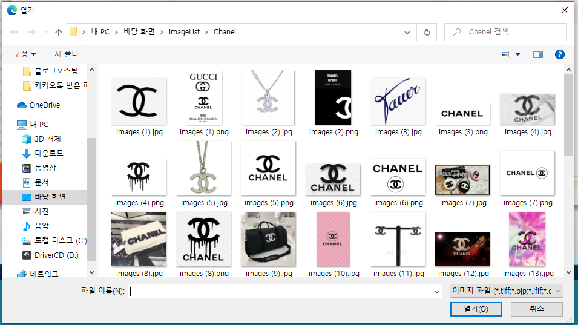
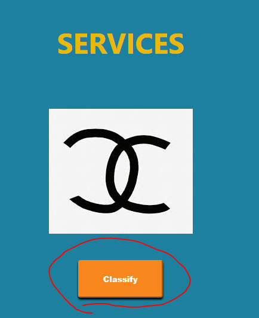
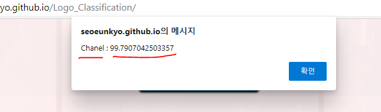

# Logo Classfication 
I learned 20 brand logos through Google Teachable Machine and created pages using react.

### Demo 
Try online demo [here](https://seoeunkyo.github.io/Logo_Classification/)

### Getting Started

```shell
$ npm install
$ npm start
# open http://localhost:3000
```


### How to use

1.  Click the icon in circle


2.  select a picture file 



3.  click the classfy Button under the picture

    


4.  you can see the reuslt 

    

